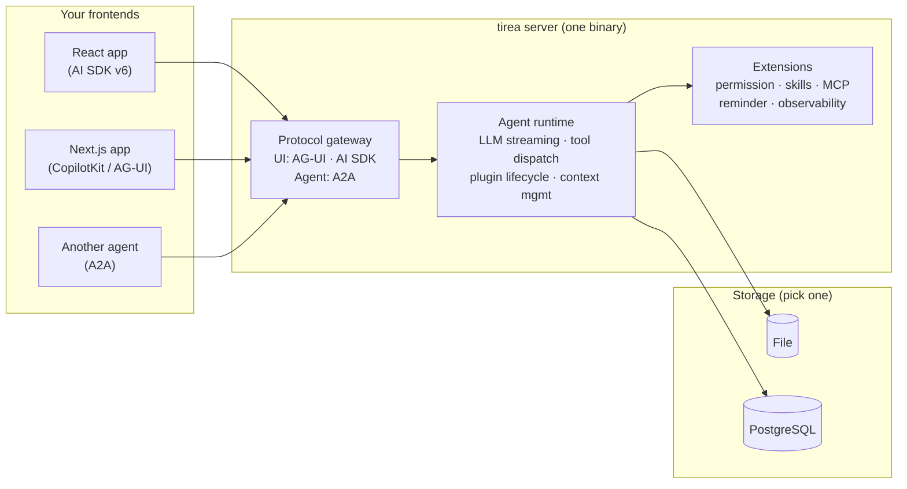

**English** | [中文](./docs/README.zh-CN.md)

# Tirea

**Type-safe AI agents that handle concurrent state without locks. One binary serves React, Next.js, and other agents over three protocols.**

Define agents, tools, and state in Rust — then serve them to any frontend over AG-UI, AI SDK v6, and A2A from a single binary. Connect to external tool servers via MCP.

[](https://crates.io/crates/tirea)
[](https://docs.rs/tirea)
[](LICENSE-MIT)

<p align="center">
  
</p>

## 30-second mental model

1. **Tools** — typed functions your agent can call; JSON schema is generated from the struct
2. **Agents** — each agent has a system prompt and a set of allowed tools/sub-agents; the LLM drives all orchestration through natural language — no DAGs or state machines like LangGraph/ADK
3. **State** — typed, scoped (thread / run / tool_call), with CRDT fields for safe concurrent writes
4. **Plugins** — lifecycle hooks for permissions, observability, context window, reminders, and more

Your agent picks tools, calls them, reads and updates state, and repeats — all orchestrated by the runtime. Every state change is an immutable patch you can replay.

## Why Tirea

| What you get | How it works |
|---|---|
| **Ship one backend for every frontend** | Serve React (AI SDK v6), Next.js (AG-UI), and other agents (A2A) from the same binary. No separate deployments. Connect to external tool servers via MCP. |
| **Let multiple agents write to the same state** | CRDT fields (`GSet`, `ORSet`, `GCounter`) merge concurrent writes automatically — you don't need locks, queues, or manual conflict resolution. |
| **Scope state to its lifetime** | Mark state as Thread-scoped (persists across conversations), Run-scoped (reset each run), or ToolCall-scoped (gone after the tool finishes). No stale data leaks between runs. |
| **Catch plugin wiring errors at compile time** | Plugins hook into 8 typed lifecycle phases. Wire a permission check to the wrong phase? The compiler tells you, not your users. |
| **Replay any conversation to any point** | Every state change is an immutable patch. Replay them to reconstruct the exact state at any point — useful for debugging, auditing, and testing. |
| **Run thousands of agents on minimal resources** | No GC pauses. ~170 KB RSS per agent run (10-turn conversation, mock LLM). 32 concurrent agents at ~1,000 runs/s. (`cargo bench --package tirea-agentos --bench runtime_throughput` to reproduce.) |

### Feature comparison

|  | Tirea | LangGraph | CrewAI | OpenAI Agents | Mastra | PydanticAI | Letta |
|---|:---:|:---:|:---:|:---:|:---:|:---:|:---:|
| **Language** | Rust | Python | Python | Python/TS | TypeScript | Python | Python |
| **Multi-protocol server** | AG-UI · AI SDK · A2A | ◐ | ❌ | ❌ | ◐ | AG-UI | REST |
| **Typed state** | ✅ derive macros | ◐ | ❌ | ❌ | ◐ | ◐ | ❌ |
| **Concurrent state (CRDT)** | ✅ | ❌ | ❌ | ❌ | ❌ | ❌ | ❌ |
| **State lifecycle scoping** | ✅ | ❌ | ❌ | ❌ | ❌ | ❌ | ❌ |
| **State replay** | ✅ | ◐ | ❌ | ❌ | ❌ | ❌ | ❌ |
| **Plugin lifecycle** | 8 typed phases | ❌ | ❌ | Guardrails | ❌ | ❌ | ❌ |
| **Sub-agents** | ✅ | ✅ | ✅ | Handoffs | ◐ | ◐ | ✅ |
| **MCP support** | ✅ | Adapter | ✅ | ✅ | ✅ | ✅ | ❌ |
| **Human-in-the-loop** | ✅ | ✅ | ❌ | ✅ | ❌ | ✅ | ❌ |
| **Built-in general tools** | ❌ | ❌ | ✅ | ❌ | ❌ | ❌ | ✅ |

✅ = native  ◐ = partial  ❌ = not available

## Quick start

### Prerequisites

- Rust toolchain from [`rust-toolchain.toml`](./rust-toolchain.toml)
- For frontend demos: Node.js 20+ and npm
- One model provider key (OpenAI, DeepSeek, Anthropic, etc.)

### Full-stack demo in 60 seconds

**React + AI SDK v6:**

```bash
git clone https://github.com/tirea-ai/tirea.git && cd tirea
cd examples/ai-sdk-starter && npm install
DEEPSEEK_API_KEY=<your-key> npm run dev
# First run compiles the Rust agent (~1-2 min), then opens http://localhost:3001
```

**Next.js + CopilotKit:**

```bash
cd examples/copilotkit-starter && npm install
cp .env.example .env.local
DEEPSEEK_API_KEY=<your-key> npm run setup:agent && npm run dev
# Open http://localhost:3000
```

### Server only

```bash
export OPENAI_API_KEY=<your-key>
cargo run --package tirea-agentos-server -- --http-addr 127.0.0.1:8080
```

## Usage

### Architecture



### Define tools, agents, and assemble

```rust
// 1. Build tools — define args as a struct, schema is generated automatically
#[derive(Deserialize, JsonSchema)]
struct SearchFlightsArgs {
    from: String,
    to: String,
    date: String,
}

struct SearchFlightsTool;

#[async_trait]
impl TypedTool for SearchFlightsTool {
    type Args = SearchFlightsArgs;
    fn tool_id(&self) -> &str { "search_flights" }
    fn name(&self) -> &str { "Search Flights" }
    fn description(&self) -> &str { "Find flights between two cities." }

    async fn execute(&self, args: SearchFlightsArgs, _ctx: &ToolCallContext<'_>)
        -> Result<ToolResult, ToolError>
    {
        // ... call your flight API ...
        Ok(ToolResult::success("search_flights", json!({
            "flights": [{"airline": "UA", "price": 342, "from": args.from, "to": args.to}]
        })))
    }
}

// 2. Define agents — each agent selects which tools/skills/sub-agents it can use
let planner = AgentDefinition::with_id("planner", "deepseek-chat")
    .with_system_prompt("You are a travel planner. Use search tools to find options.")
    .with_max_rounds(8)
    .with_allowed_tools(vec!["search_flights".into(), "search_hotels".into()])
    .with_allowed_agents(vec!["researcher".into()]);

let researcher = AgentDefinition::with_id("researcher", "deepseek-chat")
    .with_system_prompt("You research destinations and provide summaries.")
    .with_max_rounds(4)
    .with_excluded_tools(vec!["delete_account".into()]);

// 3. Assemble into AgentOs — the container for all components
let os = AgentOsBuilder::new()
    .with_tools(tool_map_from_arc(vec![
        Arc::new(SearchFlightsTool),
        Arc::new(SearchHotelsTool),
    ]))
    .with_agent_spec(AgentDefinitionSpec::local(planner))
    .with_agent_spec(AgentDefinitionSpec::local(researcher))
    .with_agent_state_store(Arc::new(FileStore::new("./sessions")))
    .build()?;
```

Tools are registered globally. Each agent controls its own access via `allowed_*` / `excluded_*` lists — the runtime filters the tool pool at resolve time.

### Connect to any frontend

Start the server, then connect from React, Next.js, or another agent — no code changes between them:

```bash
cargo run --package tirea-agentos-server -- --http-addr 127.0.0.1:8080
```

| Protocol | Endpoint | Frontend |
|---|---|---|
| AI SDK v6 | `POST /v1/ai-sdk/agents/:agent_id/runs` | React `useChat()` |
| AG-UI | `POST /v1/ag-ui/agents/:agent_id/runs` | CopilotKit `<CopilotKit>` |
| A2A | `POST /v1/a2a/agents/:agent_id/message:send` | Other agents |

**React + AI SDK v6:**

```typescript
import { useChat } from "ai/react";

const { messages, input, handleSubmit } = useChat({
  api: "http://localhost:8080/v1/ai-sdk/agents/assistant/runs",
});
```

**Next.js + CopilotKit:**

```typescript
import { CopilotKit } from "@copilotkit/react-core";

<CopilotKit runtimeUrl="http://localhost:8080/v1/ag-ui/agents/assistant/runs">
  <YourApp />
</CopilotKit>
```

### Add tools

Define args as a typed struct — the JSON schema is generated automatically from `JsonSchema`, and args are deserialized for you:

```rust
#[derive(Deserialize, JsonSchema)]
struct MyToolArgs {
    query: String,
    limit: Option<u32>,
}

struct MyTool;

#[async_trait]
impl TypedTool for MyTool {
    type Args = MyToolArgs;
    fn tool_id(&self) -> &str { "my_tool" }
    fn name(&self) -> &str { "My Tool" }
    fn description(&self) -> &str { "Does something useful." }

    async fn execute(&self, args: MyToolArgs, ctx: &ToolCallContext<'_>)
        -> Result<ToolResult, ToolError>
    {
        // Read current state
        let state = ctx.snapshot_of::<MyState>().unwrap_or_default();

        // Do work
        let result = my_api_call(&args.query, args.limit).await?;

        // Return result (optionally with state updates)
        Ok(ToolResult::success("my_tool", json!(result)))
    }
}
```

### Built-in tools

Tirea ships with tools for sub-agents, background tasks, skills, UI rendering, and MCP integration. They're auto-registered when you enable the corresponding feature:

| Tool group | Tools | What they do |
|---|---|---|
| **Sub-agents** (core) | `agent_run`, `agent_stop`, `agent_output` | Launch, cancel, and read results from child agents running in parallel |
| **Background tasks** (core) | `task_status`, `task_cancel`, `task_output` | Monitor and manage long-running background operations |
| **Skills** (`skills` feature) | `skill`, `load_skill_resource`, `skill_script` | Discover, activate, and execute skill packages |
| **A2UI** (`a2ui` extension) | `render_a2ui` | Send declarative UI components to the frontend |
| **MCP** (`mcp` feature) | *dynamic* | Tools from connected MCP servers appear as native tools |

### Require approval before dangerous actions

The built-in `PermissionPlugin` gates tool execution via Allow/Deny/Ask policies per tool. When a tool requires approval, the runtime suspends execution and sends the pending call to the frontend. When the user approves, the runtime replays the original tool call. See the [human-in-the-loop guide](https://tirea-ai.github.io/tirea/explanation/human-in-the-loop.html) for details.

### Multi-agent collaboration

Tirea agents delegate through **natural-language orchestration**. You define each agent's identity and access policy, then register them in the agent registry; the LLM decides when to delegate, to whom, and how to combine results — no DAGs, no hand-coded state machines, no explicit routing logic.

The runtime makes this work:
- **Agent registry** — register agents at build time; the runtime renders the registry into the system prompt so the LLM always knows who it can delegate to
- **Background execution with completion notifications** — sub-agents and tasks run in the background; the runtime injects their status after each tool call, so the LLM stays aware of what's running, what's finished, and what failed
- **Foreground and background modes** — block until a sub-agent finishes, or run multiple sub-agents concurrently in the background and receive completion notifications when each one finishes
- **Thread isolation** — each sub-agent runs in its own thread with independent state
- **Orphan recovery** — if the parent process crashes, orphaned sub-agents are detected and resumed on restart
- **Local + remote transparency** — in-process agents and remote A2A agents use the same `agent_run` interface; the orchestrator doesn't need to know the difference

Register agents at build time:

```rust
let orchestrator = AgentDefinition::with_id("orchestrator", "deepseek-chat")
    .with_system_prompt("Route tasks to the right agent.")
    .with_allowed_agents(vec!["researcher".into(), "writer".into()]);

let researcher = AgentDefinition::with_id("researcher", "deepseek-chat")
    .with_system_prompt("Research topics and return summaries.")
    .with_excluded_tools(vec!["agent_run".into()]); // no further delegation

let os = AgentOsBuilder::new()
    .with_agent_spec(AgentDefinitionSpec::local(orchestrator))
    .with_agent_spec(AgentDefinitionSpec::local(researcher))
    // Remote agents via A2A protocol
    .with_agent_spec(AgentDefinitionSpec::a2a_with_id(
        "writer",
        A2aAgentBinding::new("https://writer-service.example.com/v1/a2a", "writer-v2"),
    ))
    .build()?;
```

See the [multi-agent design patterns guide](https://tirea-ai.github.io/tirea/explanation/multi-agent-design-patterns.html) for coordinator, pipeline, fan-out, and other patterns.

### Manage state across conversations

State is typed and scoped to its intended lifetime:

```rust
#[derive(State)]
#[tirea(scope = "thread")]   // persists across all runs in this conversation
struct UserPreferences { /* ... */ }

#[derive(State)]
#[tirea(scope = "run")]      // reset at the start of each agent run
struct SearchProgress { /* ... */ }

#[derive(State)]
#[tirea(scope = "tool_call")] // exists only during a single tool execution
struct ToolWorkspace { /* ... */ }
```

Fields marked `#[tirea(lattice)]` use CRDT types (conflict-free replicated data types) that merge automatically when multiple agents write concurrently — no locks needed.

### Persist conversations

Swap storage backends without changing agent code:

| Backend | Use case |
|---|---|
| `FileStore` | Local development, single-server deployment |
| `PostgresStore` | Production with SQL queries and backups |
| `MemoryStore` | Tests |

### Extend with plugins

Plugins hook into 8 lifecycle phases. Use built-in plugins or write your own:

| Plugin | What it does | How to enable |
|---|---|---|
| **Context** | Token budget, message summarization, prompt caching | `ContextPlugin::for_model("claude-3-5-sonnet")` |
| **Stop Policy** | Terminate on max rounds, timeout, token budget, loop detection | `StopPolicyPlugin::new(conditions, specs)` |
| **Permission** | Allow/Deny/Ask per tool, human-in-the-loop suspension | `PermissionPlugin` + `ToolPolicyPlugin` |
| **Skills** | Discover and activate skill packages from filesystem | `skills` feature flag |
| **MCP** | Connect to MCP servers; tools appear as native tools | `mcp` feature flag |
| **Reminder** | Persistent system reminders that survive across turns | `ReminderPlugin::new()` |
| **Observability** | OpenTelemetry spans for LLM calls and tool executions | `LLMMetryPlugin::new(sink)` |
| **A2UI** | Declarative UI components sent to the frontend | `A2uiPlugin::with_catalog_id(url)` |
| **Agent Recovery** | Detect and resume orphaned sub-agent runs | Auto-wired with sub-agents |
| **Background Tasks** | Track and inject background task status | Auto-wired with task tools |

### Use any LLM provider

Powered by [genai](https://crates.io/crates/genai) — works with OpenAI, Anthropic, DeepSeek, Google, Mistral, Groq, Ollama, and more. Switch providers by changing one string:

```rust
model: "gpt-4o".into(),        // OpenAI
model: "deepseek-chat".into(), // DeepSeek
model: "claude-sonnet-4-20250514".into(), // Anthropic
```

## When to use Tirea

- You want a **Rust backend** for AI agents with compile-time safety
- You need to serve **multiple frontend protocols** from one server
- Your agents need to **share state concurrently** without coordination
- You need **auditable state history** and replay
- You're building for **production** — low memory, no GC, thousands of concurrent agents

## When NOT to use Tirea

- You need **built-in file/shell/web tools** out of the box — consider Dify, CrewAI
- You want a **visual workflow builder** — consider Dify, LangGraph Studio
- You want **Python** and rapid prototyping — consider LangGraph, PydanticAI
- You need **LLM-managed memory** (agent decides what to remember) — consider Letta

## Learning paths

| Goal | Start with | Then |
|---|---|---|
| Build your first agent | [First Agent tutorial](https://tirea-ai.github.io/tirea/tutorials/first-agent.html) | [Build an Agent guide](https://tirea-ai.github.io/tirea/how-to/build-an-agent.html) |
| See a full-stack app | [AI SDK starter](./examples/ai-sdk-starter/README.md) | [CopilotKit starter](./examples/copilotkit-starter/README.md) |
| Explore the API | [API reference](https://tirea-ai.github.io/tirea/reference/api.html) | `cargo doc --workspace --no-deps --open` |
| Contribute | [Contributing guide](./CONTRIBUTING.md) | [Capability matrix](https://tirea-ai.github.io/tirea/reference/capability-matrix.html) |

## Examples

| Example | What it shows | Best for |
|---|---|---|
| [ai-sdk-starter](./examples/ai-sdk-starter/) | React + AI SDK v6 — chat, canvas, shared state | Fastest start, minimal setup |
| [copilotkit-starter](./examples/copilotkit-starter/) | Next.js + CopilotKit — persisted threads, frontend actions | Full-stack with persistence |
| [travel-ui](./examples/travel-ui/) | Map canvas + approval-gated trip planning | Geospatial + human-in-the-loop |
| [research-ui](./examples/research-ui/) | Resource collection + report writing with approval | Approval-gated workflows |

## Documentation

Full book: <https://tirea-ai.github.io/tirea/> · [API reference](https://docs.rs/tirea) · [Book source](./docs/book/src/)

## Contributing

See [CONTRIBUTING.md](./CONTRIBUTING.md). Contributions welcome — especially:

- Built-in tool implementations (file read/write, search, shell execution)
- Tool-level concurrency safety flags
- Model fallback/degradation chains
- Token cost tracking
- Additional storage backends

## License

Dual-licensed under [MIT](./LICENSE-MIT) or [Apache-2.0](./LICENSE-APACHE).

[SECURITY.md](./SECURITY.md) · [CODE_OF_CONDUCT.md](./CODE_OF_CONDUCT.md)
