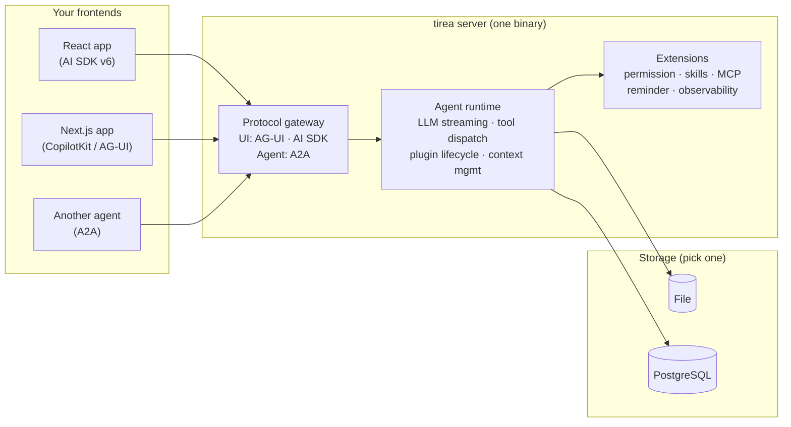

[English](../README.md) | **中文**

# Tirea

**类型安全的 AI 智能体，并发状态无需加锁。一个二进制文件通过三种协议服务 React、Next.js 和其他智能体。**

用 Rust 定义智能体、工具和状态，然后通过 AG-UI、AI SDK v6 和 A2A 协议从单一二进制文件服务任意前端。通过 MCP 连接外部工具服务器。

[](https://crates.io/crates/tirea)
[](https://docs.rs/tirea)
[](LICENSE-MIT)

<p align="center">
  
</p>

## 30 秒心智模型

1. **工具 (Tools)** — 类型化的函数，JSON Schema 从结构体自动生成
2. **智能体 (Agents)** — 每个智能体拥有系统提示和允许使用的工具/子智能体；由 LLM 通过自然语言驱动所有编排——不需要像 LangGraph/ADK 那样编写 DAG 或状态机
3. **状态 (State)** — 类型化、按作用域划分（thread / run / tool_call），CRDT 字段支持安全并发写入
4. **插件 (Plugins)** — 生命周期钩子，用于权限控制、可观测性、上下文窗口、提醒等

智能体选择工具、调用工具、读写状态、循环往复——全部由运行时编排。每次状态变更都是可回放的不可变补丁。

## 为什么选择 Tirea

| 特性 | 实现方式 |
|---|---|
| **一个后端服务所有前端** | 同一个二进制文件同时服务 React (AI SDK v6)、Next.js (AG-UI) 和其他智能体 (A2A)，无需单独部署。通过 MCP 连接外部工具服务器。 |
| **让多个智能体写入同一状态** | CRDT 字段（`GSet`、`ORSet`、`GCounter`）自动合并并发写入——你不需要锁、队列或手动冲突解决。 |
| **按生命周期划分状态作用域** | 将状态标记为 Thread 作用域（跨对话持久化）、Run 作用域（每次运行时重置）或 ToolCall 作用域（工具执行结束后销毁），避免过期数据泄漏。 |
| **在编译期捕获插件接线错误** | 插件挂载到 8 个类型化生命周期阶段。将权限检查接到错误的阶段？编译器告诉你，而不是你的用户。 |
| **回放任意对话到任意时间点** | 每次状态变更都是不可变补丁，可以重放以精确还原任意时间点的状态——用于调试、审计和测试。 |
| **用最少资源运行数千个智能体** | 无 GC 停顿。每个 agent run 约 170 KB RSS（10 轮对话，mock LLM）。32 个并发智能体可达约 1,000 runs/s。（`cargo bench --package tirea-agentos --bench runtime_throughput` 可复现。） |

### 功能对比

|  | Tirea | LangGraph | CrewAI | OpenAI Agents | Mastra | PydanticAI | Letta |
|---|:---:|:---:|:---:|:---:|:---:|:---:|:---:|
| **语言** | Rust | Python | Python | Python/TS | TypeScript | Python | Python |
| **多协议服务器** | AG-UI · AI SDK · A2A | ◐ | ❌ | ❌ | ◐ | AG-UI | REST |
| **类型化状态** | ✅ derive 宏 | ◐ | ❌ | ❌ | ◐ | ◐ | ❌ |
| **并发状态 (CRDT)** | ✅ | ❌ | ❌ | ❌ | ❌ | ❌ | ❌ |
| **状态生命周期作用域** | ✅ | ❌ | ❌ | ❌ | ❌ | ❌ | ❌ |
| **状态回放** | ✅ | ◐ | ❌ | ❌ | ❌ | ❌ | ❌ |
| **插件生命周期** | 8 个类型化阶段 | ❌ | ❌ | Guardrails | ❌ | ❌ | ❌ |
| **子智能体** | ✅ | ✅ | ✅ | Handoffs | ◐ | ◐ | ✅ |
| **MCP 支持** | ✅ | Adapter | ✅ | ✅ | ✅ | ✅ | ❌ |
| **Human-in-the-loop** | ✅ | ✅ | ❌ | ✅ | ❌ | ✅ | ❌ |
| **内置通用工具** | ❌ | ❌ | ✅ | ❌ | ❌ | ❌ | ✅ |

✅ = 原生支持  ◐ = 部分支持  ❌ = 不支持

## 快速开始

### 前置条件

- 来自 [`rust-toolchain.toml`](../rust-toolchain.toml) 的 Rust 工具链
- 前端演示需要：Node.js 20+ 和 npm
- 任意一个模型提供商的 API Key（OpenAI、DeepSeek、Anthropic 等）

### 60 秒内运行全栈演示

**React + AI SDK v6：**

```bash
git clone https://github.com/tirea-ai/tirea.git && cd tirea
cd examples/ai-sdk-starter && npm install
DEEPSEEK_API_KEY=<your-key> npm run dev
# 首次运行会编译 Rust agent（约 1-2 分钟），然后打开 http://localhost:3001
```

**Next.js + CopilotKit：**

```bash
cd examples/copilotkit-starter && npm install
cp .env.example .env.local
DEEPSEEK_API_KEY=<your-key> npm run setup:agent && npm run dev
# Open http://localhost:3000
```

### 仅启动服务器

```bash
export OPENAI_API_KEY=<your-key>
cargo run --package tirea-agentos-server -- --http-addr 127.0.0.1:8080
```

## 使用方式

### 架构



### 定义工具、智能体并组装

```rust
// 1. 构建工具 — 将参数定义为结构体，Schema 自动生成
#[derive(Deserialize, JsonSchema)]
struct SearchFlightsArgs {
    from: String,
    to: String,
    date: String,
}

struct SearchFlightsTool;

#[async_trait]
impl TypedTool for SearchFlightsTool {
    type Args = SearchFlightsArgs;
    fn tool_id(&self) -> &str { "search_flights" }
    fn name(&self) -> &str { "Search Flights" }
    fn description(&self) -> &str { "Find flights between two cities." }

    async fn execute(&self, args: SearchFlightsArgs, _ctx: &ToolCallContext<'_>)
        -> Result<ToolResult, ToolError>
    {
        // ... call your flight API ...
        Ok(ToolResult::success("search_flights", json!({
            "flights": [{"airline": "UA", "price": 342, "from": args.from, "to": args.to}]
        })))
    }
}

// 2. 定义智能体 — 每个智能体自行声明可使用的工具/技能/子智能体
let planner = AgentDefinition::with_id("planner", "deepseek-chat")
    .with_system_prompt("You are a travel planner. Use search tools to find options.")
    .with_max_rounds(8)
    .with_allowed_tools(vec!["search_flights".into(), "search_hotels".into()])
    .with_allowed_agents(vec!["researcher".into()]);

let researcher = AgentDefinition::with_id("researcher", "deepseek-chat")
    .with_system_prompt("You research destinations and provide summaries.")
    .with_max_rounds(4)
    .with_excluded_tools(vec!["delete_account".into()]);

// 3. 组装成 AgentOs — 所有组件的容器
let os = AgentOsBuilder::new()
    .with_tools(tool_map_from_arc(vec![
        Arc::new(SearchFlightsTool),
        Arc::new(SearchHotelsTool),
    ]))
    .with_agent_spec(AgentDefinitionSpec::local(planner))
    .with_agent_spec(AgentDefinitionSpec::local(researcher))
    .with_agent_state_store(Arc::new(FileStore::new("./sessions")))
    .build()?;
```

工具全局注册，每个智能体通过 `allowed_*` / `excluded_*` 列表控制自己的访问权限——运行时在解析时自动过滤。

### 连接任意前端

启动服务器，然后从 React、Next.js 或其他智能体连接——切换时无需修改代码：

```bash
cargo run --package tirea-agentos-server -- --http-addr 127.0.0.1:8080
```

| 协议 | 端点 | 前端 |
|---|---|---|
| AI SDK v6 | `POST /v1/ai-sdk/agents/:agent_id/runs` | React `useChat()` |
| AG-UI | `POST /v1/ag-ui/agents/:agent_id/runs` | CopilotKit `<CopilotKit>` |
| A2A | `POST /v1/a2a/agents/:agent_id/message:send` | 其他智能体 |

**React + AI SDK v6：**

```typescript
import { useChat } from "ai/react";

const { messages, input, handleSubmit } = useChat({
  api: "http://localhost:8080/v1/ai-sdk/agents/assistant/runs",
});
```

**Next.js + CopilotKit：**

```typescript
import { CopilotKit } from "@copilotkit/react-core";

<CopilotKit runtimeUrl="http://localhost:8080/v1/ag-ui/agents/assistant/runs">
  <YourApp />
</CopilotKit>
```

### 添加工具

将参数定义为类型化结构体——JSON Schema 由 `JsonSchema` 自动生成，参数也会自动反序列化：

```rust
#[derive(Deserialize, JsonSchema)]
struct MyToolArgs {
    query: String,
    limit: Option<u32>,
}

struct MyTool;

#[async_trait]
impl TypedTool for MyTool {
    type Args = MyToolArgs;
    fn tool_id(&self) -> &str { "my_tool" }
    fn name(&self) -> &str { "My Tool" }
    fn description(&self) -> &str { "Does something useful." }

    async fn execute(&self, args: MyToolArgs, ctx: &ToolCallContext<'_>)
        -> Result<ToolResult, ToolError>
    {
        // Read current state
        let state = ctx.snapshot_of::<MyState>().unwrap_or_default();

        // Do work
        let result = my_api_call(&args.query, args.limit).await?;

        // Return result (optionally with state updates)
        Ok(ToolResult::success("my_tool", json!(result)))
    }
}
```

### 内置工具

Tirea 内置了用于子智能体、后台任务、技能、UI 渲染和 MCP 集成的工具。启用对应的 feature 后，它们会自动注册：

| 工具组 | Tools | 功能描述 |
|---|---|---|
| **子智能体**（核心） | `agent_run`, `agent_stop`, `agent_output` | 并行启动、取消子智能体并读取其结果 |
| **后台任务**（核心） | `task_status`, `task_cancel`, `task_output` | 监控和管理长时间运行的后台操作 |
| **技能**（`skills` feature） | `skill`, `load_skill_resource`, `skill_script` | 发现、激活并执行技能包 |
| **A2UI**（`a2ui` 扩展） | `render_a2ui` | 向前端发送声明式 UI 组件 |
| **MCP**（`mcp` feature） | *动态* | 来自已连接 MCP 服务器的工具以原生工具形式呈现 |

### 在危险操作前要求审批

内置的 `PermissionPlugin` 通过 Allow/Deny/Ask 策略控制每个工具的执行权限。当工具需要审批时，运行时暂停执行并将待处理的调用发送到前端。用户批准后，运行时重放原始工具调用。详见 [human-in-the-loop 指南](https://tirea-ai.github.io/tirea/explanation/human-in-the-loop.html)。

### 多智能体协作

Tirea 智能体通过**自然语言编排**进行委派。你定义每个智能体的身份和访问策略，然后注册到智能体注册表；由 LLM 决定何时委派、委派给谁、以及如何组合结果——没有 DAG，没有手写状态机，没有显式路由逻辑。

运行时让这一切成为可能：
- **智能体注册表** — 在构建时注册智能体；运行时将注册表渲染到系统提示中，LLM 始终知道可以委派给谁
- **后台执行与完成通知** — 子智能体和任务在后台运行；运行时在每次工具调用后注入它们的状态，LLM 始终了解哪些任务正在运行、已完成或已失败
- **前台与后台模式** — 阻塞等待子智能体完成，或在后台并发运行多个子智能体并在每个完成时收到通知
- **线程隔离** — 每个子智能体在独立线程中运行，状态互不干扰
- **孤儿恢复** — 父进程崩溃后，孤立的子智能体会在重启时被检测并自动恢复
- **本地与远程透明** — 进程内智能体和远程 A2A 智能体使用相同的 `agent_run` 接口，编排者无需区分

在构建时注册智能体：

```rust
let orchestrator = AgentDefinition::with_id("orchestrator", "deepseek-chat")
    .with_system_prompt("Route tasks to the right agent.")
    .with_allowed_agents(vec!["researcher".into(), "writer".into()]);

let researcher = AgentDefinition::with_id("researcher", "deepseek-chat")
    .with_system_prompt("Research topics and return summaries.")
    .with_excluded_tools(vec!["agent_run".into()]); // no further delegation

let os = AgentOsBuilder::new()
    .with_agent_spec(AgentDefinitionSpec::local(orchestrator))
    .with_agent_spec(AgentDefinitionSpec::local(researcher))
    // Remote agents via A2A protocol
    .with_agent_spec(AgentDefinitionSpec::a2a_with_id(
        "writer",
        A2aAgentBinding::new("https://writer-service.example.com/v1/a2a", "writer-v2"),
    ))
    .build()?;
```

详见[多智能体设计模式指南](https://tirea-ai.github.io/tirea/explanation/multi-agent-design-patterns.html)，了解协调者、流水线、并行扇出等模式。

### 跨对话管理状态

状态是类型化的，并根据其预期生命周期划定作用域：

```rust
#[derive(State)]
#[tirea(scope = "thread")]   // persists across all runs in this conversation
struct UserPreferences { /* ... */ }

#[derive(State)]
#[tirea(scope = "run")]      // reset at the start of each agent run
struct SearchProgress { /* ... */ }

#[derive(State)]
#[tirea(scope = "tool_call")] // exists only during a single tool execution
struct ToolWorkspace { /* ... */ }
```

标记为 `#[tirea(lattice)]` 的字段使用 CRDT 类型（无冲突复制数据类型），当多个智能体并发写入时自动合并——无需加锁。

### 持久化对话

无需修改智能体代码即可切换存储后端：

| 后端 | 适用场景 |
|---|---|
| `FileStore` | 本地开发、单机部署 |
| `PostgresStore` | 生产环境，支持 SQL 查询和备份 |
| `MemoryStore` | 测试 |

### 通过插件扩展功能

插件挂载到 8 个生命周期阶段。可使用内置插件或自行编写：

| 插件 | 功能 | 启用方式 |
|---|---|---|
| **Context** | Token 预算、消息摘要、Prompt 缓存 | `ContextPlugin::for_model("claude-3-5-sonnet")` |
| **Stop Policy** | 按最大轮次、超时、Token 预算、循环检测终止 | `StopPolicyPlugin::new(conditions, specs)` |
| **Permission** | 按工具 Allow/Deny/Ask，human-in-the-loop 暂停 | `PermissionPlugin` + `ToolPolicyPlugin` |
| **Skills** | 从文件系统发现并激活技能包 | `skills` feature flag |
| **MCP** | 连接 MCP 服务器，工具以原生形式呈现 | `mcp` feature flag |
| **Reminder** | 跨轮次持久化的系统提醒 | `ReminderPlugin::new()` |
| **Observability** | LLM 调用和工具执行的 OpenTelemetry span | `LLMMetryPlugin::new(sink)` |
| **A2UI** | 向前端发送声明式 UI 组件 | `A2uiPlugin::with_catalog_id(url)` |
| **Agent Recovery** | 检测并恢复孤立的子智能体运行实例 | 随子智能体自动接入 |
| **Background Tasks** | 追踪并注入后台任务状态 | 随任务工具自动接入 |

### 使用任意 LLM 提供商

基于 [genai](https://crates.io/crates/genai) 构建——支持 OpenAI、Anthropic、DeepSeek、Google、Mistral、Groq、Ollama 等。只需修改一个字符串即可切换提供商：

```rust
model: "gpt-4o".into(),        // OpenAI
model: "deepseek-chat".into(), // DeepSeek
model: "claude-sonnet-4-20250514".into(), // Anthropic
```

## 适合使用 Tirea 的场景

- 希望用 **Rust 后端**构建具备编译期安全性的 AI 智能体
- 需要从一个服务器提供**多种前端协议**
- 多个智能体需要**无需协调地并发共享状态**
- 需要**可审计的状态历史**和回放能力
- 面向**生产环境**构建——低内存占用、无 GC、支持数千个并发智能体

## 不适合使用 Tirea 的场景

- 需要开箱即用的**文件/Shell/网页工具**——可以考虑 Dify、CrewAI
- 想要**可视化工作流构建器**——可以考虑 Dify、LangGraph Studio
- 偏好 **Python** 和快速原型开发——可以考虑 LangGraph、PydanticAI
- 需要 **LLM 管理的记忆**（由智能体决定记住什么）——可以考虑 Letta

## 学习路径

| 目标 | 从这里开始 | 然后 |
|---|---|---|
| 构建第一个智能体 | [First Agent 教程](https://tirea-ai.github.io/tirea/tutorials/first-agent.html) | [构建智能体指南](https://tirea-ai.github.io/tirea/how-to/build-an-agent.html) |
| 查看完整全栈应用 | [AI SDK starter](../examples/ai-sdk-starter/README.md) | [CopilotKit starter](../examples/copilotkit-starter/README.md) |
| 探索 API | [API 参考](https://tirea-ai.github.io/tirea/reference/api.html) | `cargo doc --workspace --no-deps --open` |
| 参与贡献 | [贡献指南](../CONTRIBUTING.md) | [能力矩阵](https://tirea-ai.github.io/tirea/reference/capability-matrix.html) |

## 示例

| 示例 | 展示内容 | 适合 |
|---|---|---|
| [ai-sdk-starter](../examples/ai-sdk-starter/) | React + AI SDK v6 — 聊天、画布、共享状态 | 最快上手，最少配置 |
| [copilotkit-starter](../examples/copilotkit-starter/) | Next.js + CopilotKit — 持久化对话、前端操作 | 全栈 + 持久化 |
| [travel-ui](../examples/travel-ui/) | 地图画布 + 需审批的行程规划 | 地理空间 + 人机交互 |
| [research-ui](../examples/research-ui/) | 资源收集 + 需审批的报告撰写 | 审批控制工作流 |

## 文档

完整文档：<https://tirea-ai.github.io/tirea/> · [API 参考](https://docs.rs/tirea) · [文档源码](./book/src/)

## 贡献

详见 [CONTRIBUTING.md](../CONTRIBUTING.md)，欢迎贡献——特别期待以下方面：

- 内置工具实现（文件读写、搜索、Shell 执行）
- 工具级并发安全标志
- 模型降级/回退链
- Token 成本追踪
- 更多存储后端

## 许可证

双协议授权：[MIT](../LICENSE-MIT) 或 [Apache-2.0](../LICENSE-APACHE)。

[SECURITY.md](../SECURITY.md) · [CODE_OF_CONDUCT.md](../CODE_OF_CONDUCT.md)
