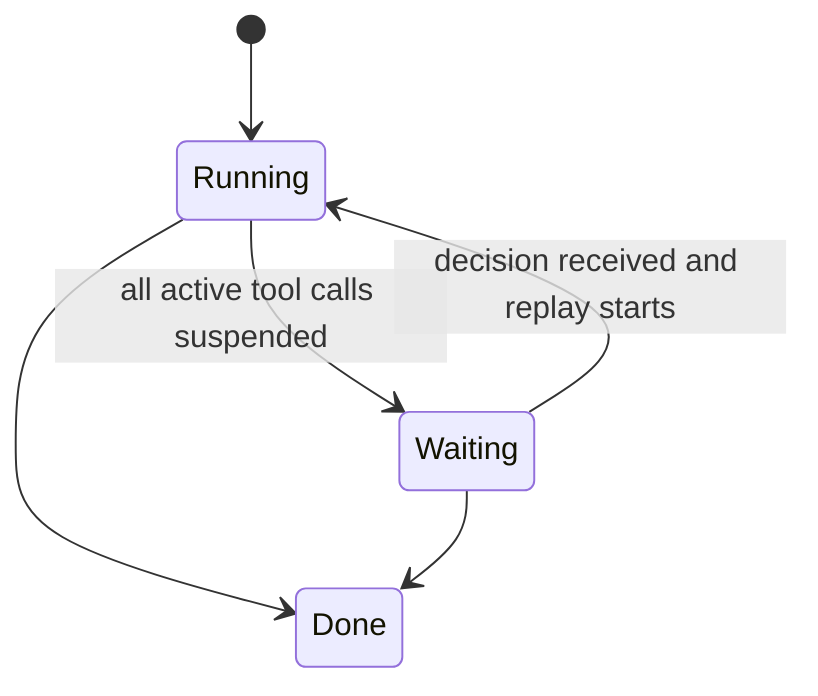
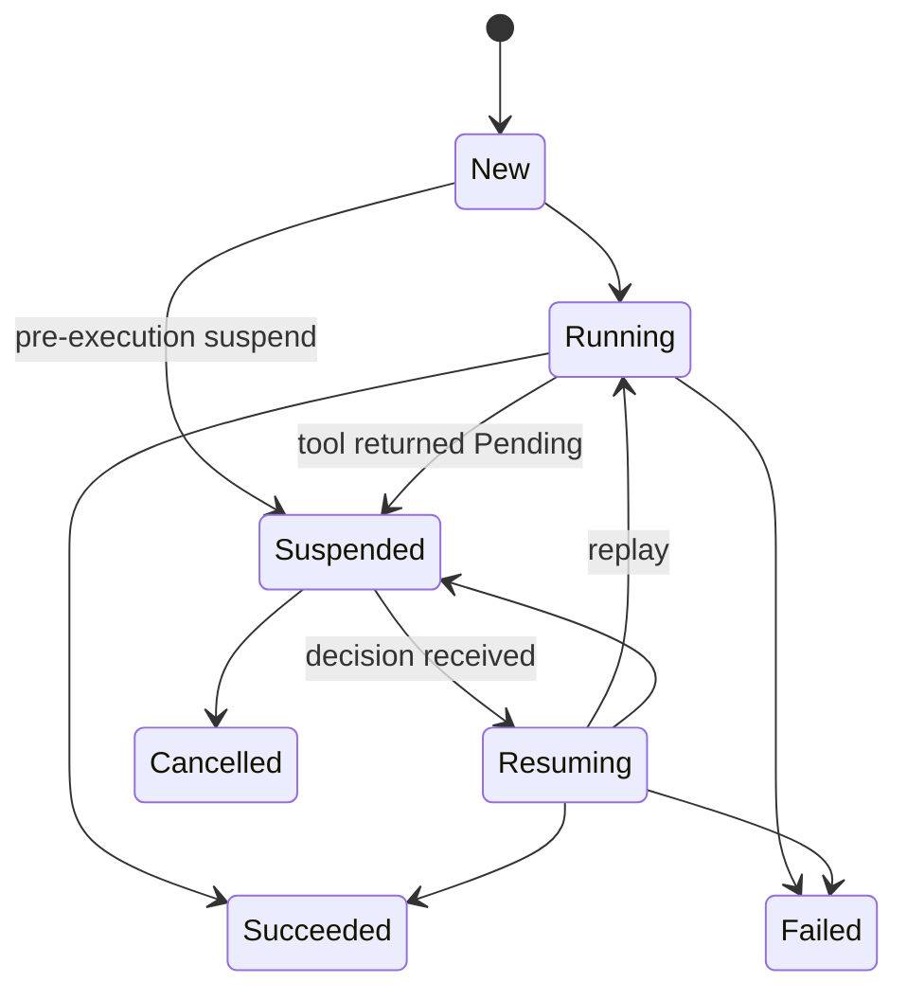

# Frontend Interaction and Approval Model

Tirea treats frontend tool calls, permission approvals, and other human-in-the-loop interactions as one runtime model rather than unrelated ad-hoc features.

The core idea is:

```text
tool or plugin requests suspension
-> runtime persists pending call state
-> client returns a decision
-> runtime replays deterministically
```

> In code, "plugin" refers to a type that implements the `AgentBehavior` trait.

This is why frontend tools, approval dialogs, and other manual intervention points all fit the same machinery.

## The Problem This Model Solves

Agent systems often need hard pauses that depend on an external actor:

- a frontend tool must run in the browser, not on the backend
- a permission gate must ask a human before continuing
- a structured form or approval card must collect additional input
- a run must survive process boundaries and resume later

If each of these is implemented as a separate custom transport callback, the runtime becomes hard to reason about and impossible to replay consistently.

Tirea instead normalizes them into:

- phase actions
- suspended tool calls
- decision forwarding
- deterministic replay

## One Abstraction, Multiple Use Cases

### Case 1: Frontend tool execution

A tool is selected by the model, but execution must happen in the frontend.

The backend:

- does not execute the tool locally
- suspends the tool call
- emits a pending interaction payload

The frontend:

- renders the tool UI
- returns either a result (`resume`) or a rejection (`cancel`)

The runtime:

- stores the decision
- resumes the call using the configured resume mode

### Case 2: Permission approval

A tool is executable in principle, but policy requires explicit approval first.

The permission plugin:

- inspects current policy state in `BeforeToolExecute`
- blocks, allows, or suspends

If it suspends:

- the run may move to `Waiting`
- the client later forwards an approval decision
- the runtime replays the call

### Case 3: Other manual intervention

The same pattern also works for:

- confirm/delete flows
- structured input requests
- frontend-generated intermediate results
- UI-only actions that still need durable runtime coordination

## Why These Are Unified

These scenarios look different at the UI layer, but they are the same at the runtime layer:

1. execution cannot proceed right now
2. the reason must be persisted durably
3. an external actor must provide input
4. resumed execution must be deterministic

That common shape is why Tirea models them all as suspended tool calls plus replay, instead of bespoke UI callbacks.

## The Runtime Pieces

The unified model is built from a small set of primitives:

- `BeforeToolExecuteAction::Suspend`
- `BeforeToolExecuteAction::SetToolResult`
- `BeforeToolExecuteAction::Block`
- `SuspendTicket`
- per-call suspended state
- decision forwarding
- replay of the original tool call

These primitives are transport-independent. AG-UI, AI SDK, and Run API adapters only change how requests and events are encoded.

## Run State Machine

Run-level status tracks whether the whole run is still making progress or is waiting on external input.



Meaning:

- `Running`: model inference and/or tool execution is still progressing
- `Waiting`: the run cannot continue until an external decision arrives
- `Done`: terminal exit, including suspended-terminal completion for the current run attempt

This is the run-level view that frontends often surface as "working", "needs input", or "finished".

## Tool Call State Machine

Each tool call has its own lifecycle.



This is what lets one run contain multiple independently suspended or resumed calls.

## How Frontend Tools Fit

Frontend tools are not a separate execution engine. They are runtime-managed suspended calls with a special resume path.

In AG-UI integrations:

- backend recognizes a tool should execute in the frontend
- backend emits `BeforeToolExecuteAction::Suspend`
- frontend collects UI input or performs the browser-side action
- frontend sends a decision back
- backend converts that decision into tool result semantics and continues

This is why frontend tool execution still participates in:

- tool-call status tracking
- run suspension
- persistence
- replay

## How Permission Approval Fits

Permission approval is also not a separate subsystem. It is a policy plugin layered on the same suspended-call model.

The permission plugin decides among:

- `allow`
- `deny`
- `ask`

In code these map to `ToolPermissionBehavior` variants: `Allow` (no action emitted),
`Deny` → `BeforeToolExecuteAction::Block(reason)`, `Ask` → `BeforeToolExecuteAction::Suspend(ticket)`.

`ask` becomes:

- `BeforeToolExecuteAction::Suspend`
- pending call persisted in runtime state
- external approval needed
- replay on decision

So permission approval and frontend tool execution differ in policy and UI, but not in their core state-machine mechanics.

## Why Replay Matters

The external client never mutates the tool call in place.

Instead, the client submits a decision payload, and the runtime:

1. records the decision
2. resolves the matching suspended call
3. marks the call `Resuming`
4. replays the original tool call or converts the decision into a tool result, depending on resume mode

That gives you:

- deterministic behavior
- auditability
- testability
- transport independence

Without replay, approval and frontend tool flows become opaque side channels.

## Manual Integration Points

The framework intentionally abstracts manual integration points into a small number of contracts.

What the application or frontend still has to do:

- render pending interactions
- collect human decisions or frontend tool outputs
- forward decisions back over the chosen transport

What the runtime already standardizes:

- suspension semantics
- state persistence
- per-call status
- run waiting/resume transitions
- replay behavior

This separation is the main design reason frontend integrations stay relatively thin even when the UX is rich.

## Which Layer Owns What

Use this split:

- tool:
  domain work, typed state mutation, result generation, post-tool effects
- plugin:
  cross-cutting gates and orchestration, such as permission checks and tool filtering
- transport adapter:
  maps protocol payloads/events to runtime contracts
- frontend:
  renders state, pending interactions, and decision UIs

If a rule must apply uniformly across many tools, it belongs in a plugin.
If a specific capability needs user input as part of its domain flow, it may still be modeled as a suspended tool call.

## What To Read Next

- For the full phase/run/tool state machines:
  [Run Lifecycle and Phases](./run-lifecycle-and-phases.md)
- For approval and decision semantics:
  [HITL and Decision Flow](./hitl-and-decision-flow.md)
- For AG-UI frontend tool transport behavior:
  [AG-UI Protocol](../reference/protocols/ag-ui.md)
- For permission wiring:
  [Enable Tool Permission HITL](../how-to/enable-tool-permission-hitl.md)
